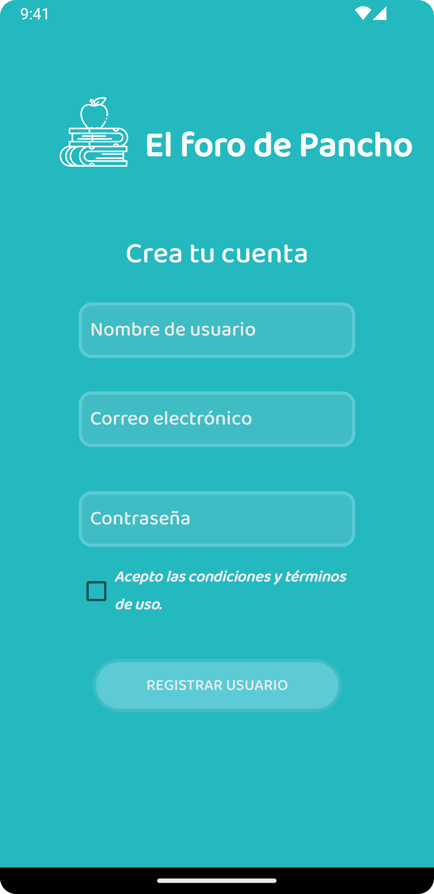
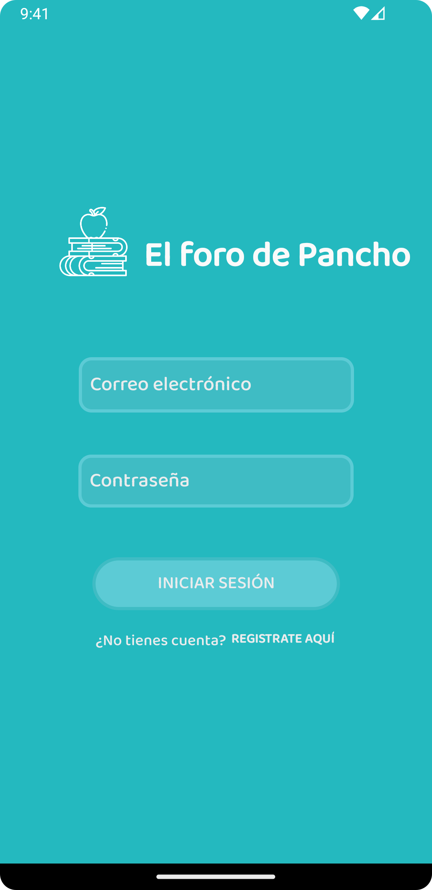
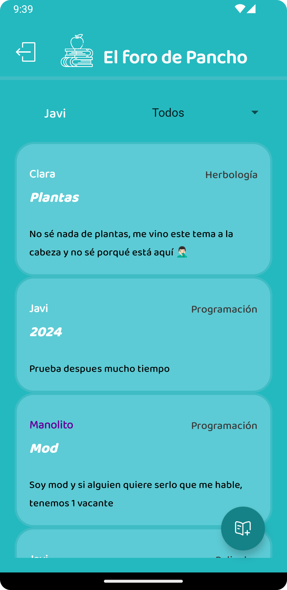
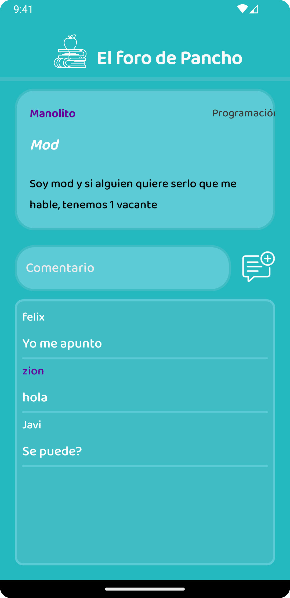
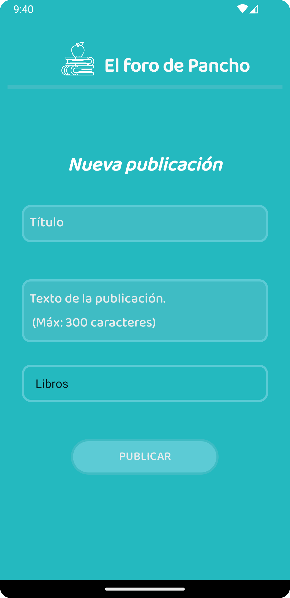

# El Foro de Pancho

El Foro de Pancho es una aplicación de foro desarrollada en Android Studio con Java donde los usuarios pueden crear publicaciones sobre cualquier tema, comentar en publicaciones de otros usuarios y gestionar sus cuentas mediante registro e inicio de sesión.

La aplicación tiene dos niveles de usuarios:

- Usuario normal: puede realizar publicaciones, eliminar sus publicaciones y comentar en las demás publicaciones.

- Usuario moderador: puede realizar las mismas acciones que el usuario normal, pero además puede eliminar publicaciones y cualquier comentario.

## Tecnologías utilizadas

<div align="center">
   
   
   
</div>

## Demo

### Registro e inicio de sesión

<div align="center">
   
   
</div>

### Publicaciones

<div align="center">
   
   
</div>

### Nuevo Post

<div align="center">
   
</div>

## Instalación

1. Clona este repositorio:

   ```sh
      git clone https://github.com/JvrGrc/ForoAndroidApp.git
   ```

2. Abre el proyecto en Android Studio.

3. Compila y ejecuta la aplicación en un dispositivo o emulador Android.

## API

Esta aplicación utiliza [Firebase](https://firebase.google.com/?hl=es-419) para la autenticación y almacenamiento de datos.

## License

[MIT](https://choosealicense.com/licenses/mit/)
